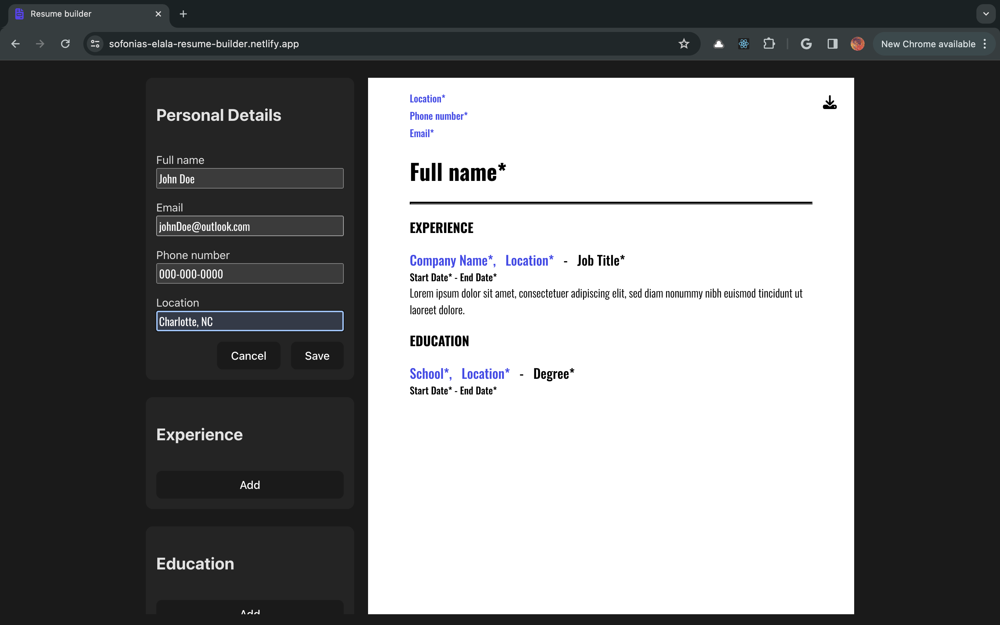
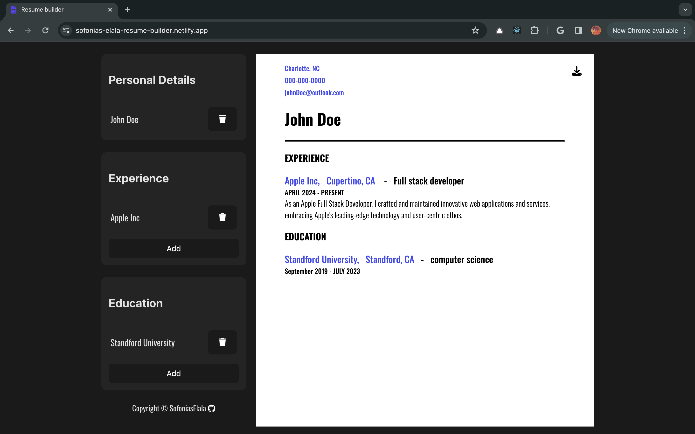
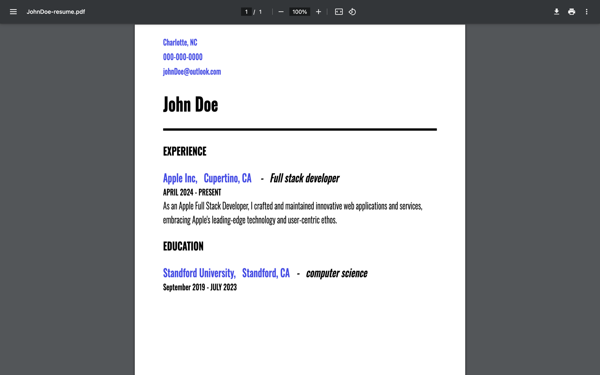

# Resume builder
 
## Description
### This app is a resume builder that creates a simple straight forward resume file.

1. #### User-Friendly Interface:
     * it offers an intuitive and easy-to-use interface, enabling users to create their resumes quickly and efficiently.  
2. #### Download as PDF:
     * With a single click, users can download their completed resume as a PDF file.

## Screenshots

## Technologies Used:

  * REACT + Vite
  * HTML5
  * CSS3
  * version control with Git/GitHub
  * Hosting on Netlify

## Dependencies
  * REACT + Vite
  * html2canvas & jsPDF - for creating PDFs
  * uuid - generate unique identifiers
  * eslint - airbnb style guide
